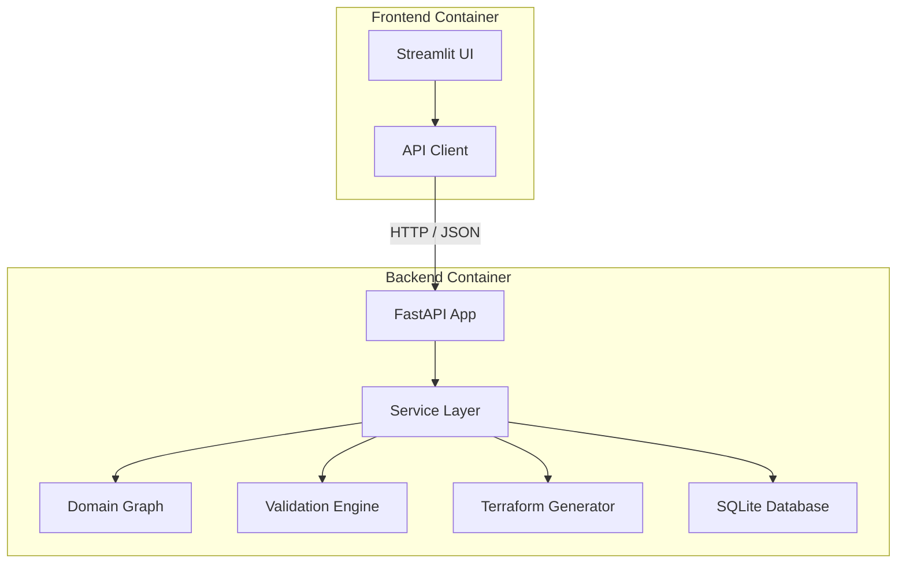
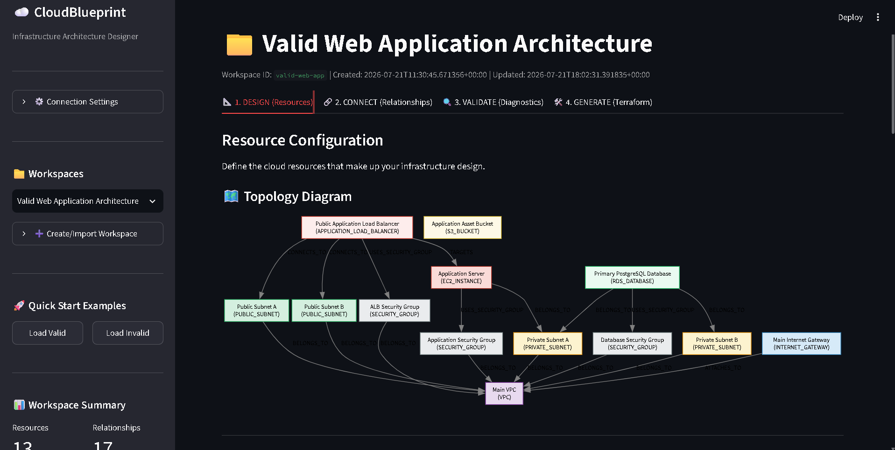
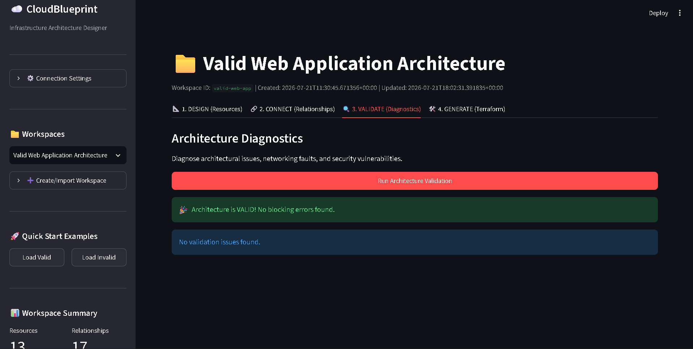
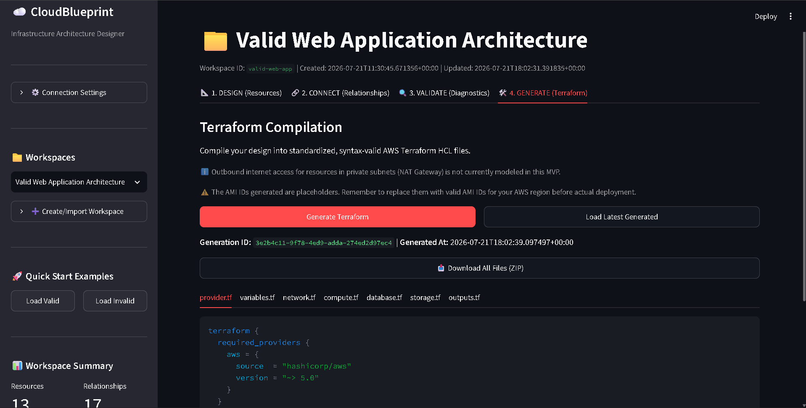

# CloudBlueprint

[](https://www.python.org/)
[](https://fastapi.tiangolo.com/)
[](https://streamlit.io/)
[](https://www.terraform.io/)
[](https://www.docker.com/)
[](LICENSE)

CloudBlueprint is an offline cloud infrastructure designer, validator, and Terraform code generator. It allows users to visually configure AWS resource topologies, run diagnostics to check against architectural and security best practices, and compile designs into syntactically valid Terraform HCL files.

> [!NOTE]
> CloudBlueprint is a design-time assistant and scaffolding engine. It does not provision real AWS resources or run `terraform apply` directly.

---

## 📐 Core Workflow

CloudBlueprint organizes infrastructure workspace tasks into four consecutive, logical phases:

```
  DESIGN  ->  CONNECT  ->  VALIDATE  ->  GENERATE
(Resources)  (Relationships) (Diagnostics)  (Terraform)
```

1. **DESIGN (Resources):** Create or select an architecture workspace. Add and customize AWS resources (VPCs, subnets, EC2s, RDS, etc.) with specific properties and tags. A dynamic read-only visual topology graph is rendered automatically based on resources and connections.
2. **CONNECT (Relationships):** Define directed connections representing logical bindings (e.g. subnets `BELONGS_TO` VPC, EC2 instance `USES_SECURITY_GROUP` Security Group, ALB `TARGETS` EC2).
3. **VALIDATE (Diagnostics):** Trigger graph-based diagnostics checkups to discover validation errors (e.g. RDS databases lacking multi-AZ subnets) or configuration warnings.
4. **GENERATE (Terraform):** Compile design graphs into standardized, canonical Terraform HCL files. Preview files, check generation history, or download the workspace bundle as a ZIP archive.

---

## ⚡ Main Features

* **Visual Architecture Workspaces:** Create, select, import, and delete isolated workspaces.
* **AWS Resource Modeling:** Configure a variety of supported AWS resources:
  * Network: `VPC`, `PUBLIC_SUBNET`, `PRIVATE_SUBNET`, `INTERNET_GATEWAY`
  * Compute & Load Balancing: `EC2_INSTANCE`, `APPLICATION_LOAD_BALANCER`, `SECURITY_GROUP`
  * Database & Storage: `RDS_DATABASE`, `S3_BUCKET`
* **Graph-based Traversal:** Internal graph abstraction translates resources and relationships to discover validation issues.
* **Extensible Validation Engine:** Evaluates security and routing checks. Validation errors block Terraform generation, preventing malformed deployment code.
* **Formatted HCL Compilation:** Generates structured Terraform HCL files (`provider.tf`, `variables.tf`, `network.tf`, `compute.tf`, `database.tf`, `storage.tf`, `outputs.tf`) with canonical spacing and aligned attributes.
* **ZIP Archive Export:** Package generated configurations for immediate local download.
* **Non-Root Docker Execution:** Fully hardened Docker configurations running under non-privileged system users.
* **High-Concurrency SQLite:** SQLite integration hardened with transaction timeouts and Write-Ahead Logging (WAL) mode.

---

## 🏛️ Application Architecture

CloudBlueprint utilizes a multi-tiered architecture split into frontend and backend services:



* **Streamlit Frontend:** Serves the interactive user interface, rendering tables, forms, and visual graphs server-side.
* **FastAPI Backend:** Exposes RESTful JSON endpoints managing resources, relationships, and generation actions.
* **Service Layer:** Coordinates database storage transactions and links API requests to core engines.
* **Domain Engines:** Contains the graph model, the AWS validator rules, and the HCL block compiler.
* **SQLite Persistence:** Stores persistent workspaces and generation history.

---

## 🔍 Validation Rules & Diagnostics

Diagnostics run check rules across the topology graph. Terraform generation is blocked if `ERROR` or `CRITICAL` issues exist.

| Rule ID | Severity | Category | Rule Description |
| :--- | :---: | :--- | :--- |
| **REF001** | `ERROR` | Integrity | All relationship target and source resource IDs must exist. |
| **DEP001** | `ERROR` | Dependency | Explicit resource dependencies (`DEPENDS_ON`) must not form cycles. |
| **NET001** | `ERROR` | Network | Subnets must belong to a VPC. |
| **NET002** | `ERROR` | Network | Internet Gateways must attach to a VPC. |
| **NET003** | `ERROR` | Network | Internet-facing ALBs must connect to public subnets in at least two distinct AZs. |
| **NET004** | `ERROR` | Network | Security Groups must belong to a VPC. |
| **NET005** | `ERROR` | Network | VPCs containing public subnets must have an Internet Gateway attached. |
| **DB001** | `ERROR` | Database | RDS databases must belong to at least two private subnets in distinct AZs. |
| **DB002** | `WARNING` | Database | RDS databases should not be publicly accessible. |
| **CMP001** | `ERROR` | Compute | EC2 instances must belong to a subnet. |
| **CMP002** | `ERROR` | Compute | EC2 instances must use at least one Security Group. |
| **LB001** | `ERROR` | Load Balancer | Load balancers must target at least one EC2 instance. |

---

## 🖼️ Interface & Visuals

Here is a preview of the CloudBlueprint designer interface, diagnostics, and compiler workflows:

### 1. Design & Topology


### 2. Validation Diagnostics


### 3. Terraform Generation



---

## 🛠️ Getting Started

### Prerequisites
* Python 3.11 or higher
* Docker & Docker Compose (optional, for containerized run)

### Option A: Local Python Development

1. **Install Package & Dependencies:**
   ```powershell
   python -m pip install -e .
   ```

2. **Start the FastAPI Backend:**
   ```powershell
   python -m uvicorn cloudblueprint.backend.main:app --host 127.0.0.1 --port 8000
   ```
   Auto-generated API docs will be available at [http://127.0.0.1:8000/docs](http://127.0.0.1:8000/docs).

3. **Start the Streamlit Frontend:**
   ```powershell
   python -m streamlit run cloudblueprint/frontend/app.py --server.port 8501 --server.address 127.0.0.1
   ```
   The UI will be available at [http://127.0.0.1:8501](http://127.0.0.1:8501).

### Option B: Docker Compose

Build and launch the containerized application stack:
```powershell
docker compose build
docker compose up -d
```

* **Streamlit Frontend:** [http://localhost:8501](http://localhost:8501)
* **FastAPI Backend:** [http://localhost:8000](http://localhost:8000)
* **Named Storage Volume:** Persists database entries at `/data/cloudblueprint.sqlite3` via the `sqlite_data` volume.

To stop and remove containers:
```powershell
docker compose down
```

---

## 🔒 Security & Hardening Measures

* **Non-Root Containers:** Backend and frontend containers switch privileges to `USER appuser` (UID/GID 10001) during runtime, mitigating host system escape vulnerabilities.
* **SQLite WAL & Locking Timeouts:** Configured connection timeouts of 10 seconds and enabled Write-Ahead Logging (WAL) mode to protect against write locking conflicts.
* **Strict Generation Blocking:** Preventative check execution blocks malformed graph generation prior to HCL export.
* **No Direct Provisioning:** Offline-only code generation minimizes security risks associated with AWS access credentials.

---

## 🧪 Testing & Verification

The suite includes tests for domain models, validation, database repository transactions, and API endpoints.

Run the test suite locally:
```powershell
python -m pytest --basetemp=tmp_pytest_dir -p no:cacheprovider
```

* **Current Verified Test Result:** **48 passed** / 0 failed.
* **HCL Formatting & Syntax Verification:** All generated HCL compiles and validates against Terraform CLI (`terraform fmt -check`, `terraform init`, and `terraform validate` pass).

---

## 📁 Repository Structure

```
.
├── cloudblueprint/              # Main Package Directory
│   ├── backend/                 # API, Service Layer, and Database
│   │   ├── api/                 # FastAPI routes and validation helpers
│   │   ├── database/            # SQLite connection and repository tables
│   │   ├── generators/          # HCL syntax blocks and Terraform compiler
│   │   ├── models/              # Pydantic schema validation models
│   │   ├── services/            # Core business service layer
│   │   └── validators/          # Subnet, database, and EC2 rule classes
│   └── frontend/                # Streamlit UI app and API client
├── examples/                    # Valid/Invalid architecture JSONs
├── tests/                       # Pytest unit and integration suite
├── Dockerfile.backend           # Non-root FastAPI Dockerfile
├── Dockerfile.frontend          # Non-root Streamlit Dockerfile
├── docker-compose.yml           # Local multi-container compose configuration
├── pyproject.toml               # Package dependencies configuration
└── LICENSE                      # MIT License
```

---

## ⚠️ Limitations & Scope

* **AWS Scope:** CloudBlueprint currently models AWS resources only.
* **No State Tracking:** The compiler generates raw HCL code blocks, not active Terraform tfstate files.
* **Scaffolding Only:** Generated configuration includes placeholder properties (e.g. region-agnostic AMI IDs). Verify configurations before applying them.

---

## 📄 License

Distributed under the MIT License. See [LICENSE](LICENSE) for more information.
